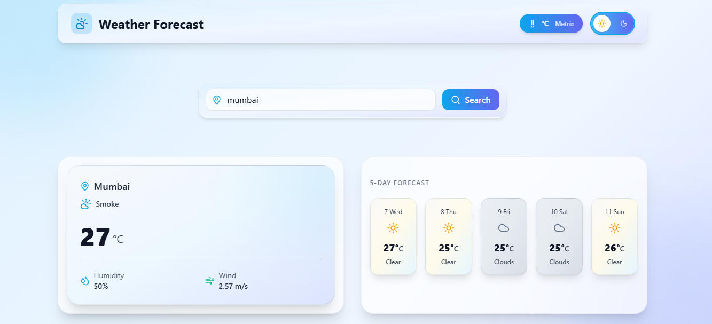
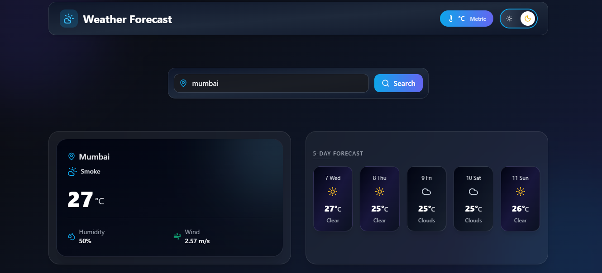
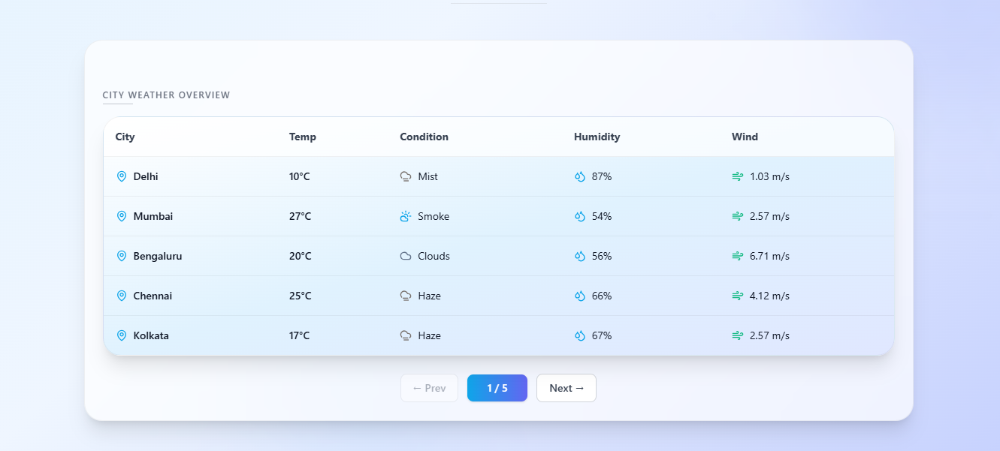

# 🌤️ Weather Forecast Web Application

A modern, responsive Weather Forecasting Web Application built using **Next.js**, **TypeScript**, and **Tailwind CSS**.  
The app fetches real-time weather data and displays current conditions, a 5-day forecast, and a paginated city weather table.

---

## 🚀 Live Demo
👉 Deployed on Vercel  
**Live URL:** https://weather-forecast-umber-eight.vercel.app/

---

## 🛠️ Tech Stack

- **Next.js (App Router)**
- **React (Functional Components & Hooks)**
- **TypeScript**
- **Tailwind CSS**
- **OpenWeatherMap API**

---

## ✨ Features

- 🔍 Search weather by city name
- 📍 Auto-detect user location using Geolocation API
- 🌡️ Unit toggle (°C / °F)
- 🌗 Dark mode toggle
- 📅 5-day weather forecast
- 🏙️ City weather table (25 cities) with pagination
- ⏳ Skeleton loading states
- ⚠️ Graceful error handling (invalid city, network issues)
- ⚡ Optimized API calls with memoization
- 🧠 Clean, reusable component architecture
- 🔐 API keys secured using environment variables

---

## 📸 Screenshots

### 🔹 Home Page (Light Mode)


### 🔹 Home Page (Dark Mode)


### 🔹 City Weather Table with Pagination


---

## ⚙️ Setup & Installation

### 1️⃣ Clone the repository
```bash
git clone https://github.com/riyalchandrakar/Weather-Forecast.git
cd Weather-Forecast
```
### 2️⃣ Install dependencies
```bash
npm install
```
### 3️⃣ Configure environment variables

Create a .env.local file in the root directory:
```bash
NEXT_PUBLIC_WEATHER_API_KEY=your_openweathermap_api_key
```

### 4️⃣ Run the development server
```bash
npm run dev
```
Open:

👉 http://localhost:3000


## 🧪 Build for Production
```bash
npm run build
npm start
```

## 📌 Design & Architecture Notes

 - Weather fetching logic is abstracted into a custom hook (useWeather)

 - Geolocation handling is isolated in useGeolocation

 - Strong TypeScript typing ensures safety across API, hooks, and UI

 - Pagination and table logic are self-contained for better scalability

 - Follows React and Next.js best practices


## 📝 Evaluation Alignment

 This project fulfills all assignment requirements:

 ✅ Responsive UI

 ✅ TypeScript safety

 ✅ API integration & error handling

 ✅ Performance optimizations

 ✅ Clean code structure

 ✅ Dark mode & unit toggle

 ✅ 5-day forecast

 ✅ City table with pagination

<br>

## 👤 Author
 Riyal Chandrakar<br>
 Frontend Developer
___
